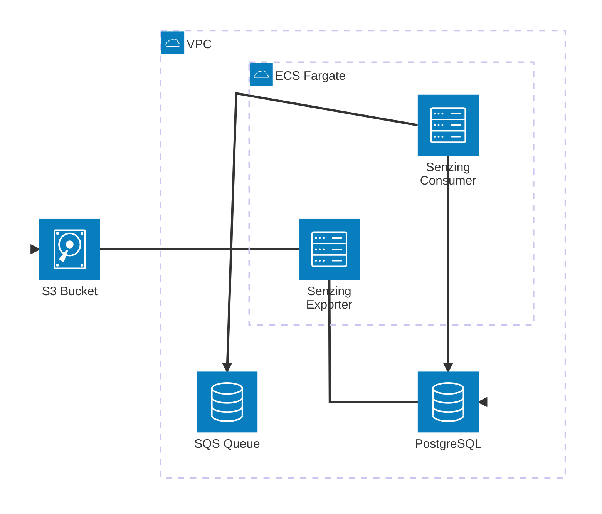

# SQS Entity Resolution using Senzing

This is an implementation of entity resolution using [Senzing] with [AWS
SQS][sqs]. Data is sent to an SQS queue, which is processed by a "consumer"
service that forwards the data to Senzing for entity resolution. The results can
then be exported to an S3 bucket.



## Local development with Docker

This repository includes a `docker-compose.yml` file that can be used to develop
and run the consumer service on our local machine. This setup includes:

- [SQS][sqs-local] and [S3][s3-local] emulators using [LocalStack]
  - An S3 bucket named `sqs-senzing-local-export`
  - An SQS queue named `sqs-senzing-local-ingest`
  - An SQS queue named `sqs-senzing-local-redo`
- A local PostgreSQL database
- A database initialization container to set up the Senzing schema
- The Senzing consumer service
- A `tools` container with the [Senzing v4 SDK][senzing-sdk] and
  [`awslocal`][awslocal] wrapper for interacting with LocalStack services

### Starting the services

1. Build the necessary images:

   ```bash
   docker compose build
   ```

1. Start the services:

   ```bash
   docker compose up -d
   ```

### Consumer

Spinning up a consumer service (intended to be a continually-running process; in
a production scenarion, multiple instances could be running simultaneously as
needed):

   ```bash
   docker compose run --env AWS_PROFILE=localstack --env \
   Q_URL="http://sqs.us-east-1.localhost.localstack.cloud:4566/000000000000/sqs-senzing-local-ingest" \
   --env LOG_LEVEL=INFO consumer
   ```

`LOG_LEVEL` is optional; defaults to `INFO`.

### Exporter

Spinning up the exporter middleware (this is intended to be an ephemeral
container):

  ```bash
  docker compose run --env AWS_PROFILE=localstack --env S3_BUCKET_NAME=sqs-senzing-local-export \
  --env LOG_LEVEL=INFO exporter
  ```

`LOG_LEVEL` is optional; defaults to `INFO`.

You can view information about files in the Localstack S3 bucket by visiting
this URL:

  http://localhost:4566/sqs-senzing-local-export

### Using the services (Tools container)

1. Access the `tools` container to interact with the services:

   ```bash
   docker compose run tools /bin/bash
  ```

The `tools` container should be configured with the necessary environment
variables to interact with the SQS and S3 services in LocalStack, as well as the
Senzing SDK.

You can use the `awslocal` command to interact with the SQS and S3 services. For
example, to send a message to the SQS queue:

```bash
awslocal sqs send-message \
  --queue-url http://sqs.us-east-1.localhost.localstack.cloud:4566/000000000000/sqs-senzing-local-ingest \
  --message-body '{"NAME_FULL":"Robert Smith", "DATE_OF_BIRTH":"7/4/1976", "PHONE_NUMBER":"555-555-2088"}'
```

View queues:

    awslocal sqs list-queues

View queue message count, etc.:

    awslocal sqs get-queue-attributes --queue-url \
    http://sqs.us-east-1.localhost.localstack.cloud:4566/000000000000/sqs-senzing-local-ingest \
    --attribute-names All

You can use the Senzing SDK's `sz_*` commands to interact with the Senzing
database. For example, to add a new entity:

```bash
sz_command -C add_record \
  PEOPLE 1 '{"NAME_FULL":"Robert Smith", "DATE_OF_BIRTH":"7/4/1976", "PHONE_NUMBER":"555-555-2088"}'
```

### Utilities

Load a single record as a simple test:

    docker compose run util util_load_record.py

Purge the database:

    docker compose run util util_purge_db.py

Copy a file out of the LocalStack S3 bucket into `~/tmp` on your machine (be 
sure this folder already exists):

    docker compose run util util_s3_retrieve.py hemingway.txt

Purge the LocalStack S3 bucket:

    docker compose run util util_purge_s3.py


[awslocal]: https://docs.localstack.cloud/aws/integrations/aws-native-tools/aws-cli/#localstack-aws-cli-awslocal
[localstack]: https://www.localstack.cloud/
[senzing]: https://senzing.com
[senzing-sdk]: https://senzing.com/docs/python/4/
[s3-local]: https://docs.localstack.cloud/aws/services/s3/
[sqs]: https://docs.aws.amazon.com/AWSSimpleQueueService/latest/SQSDeveloperGuide/welcome.html
[sqs-local]: https://docs.localstack.cloud/aws/services/sqs/
