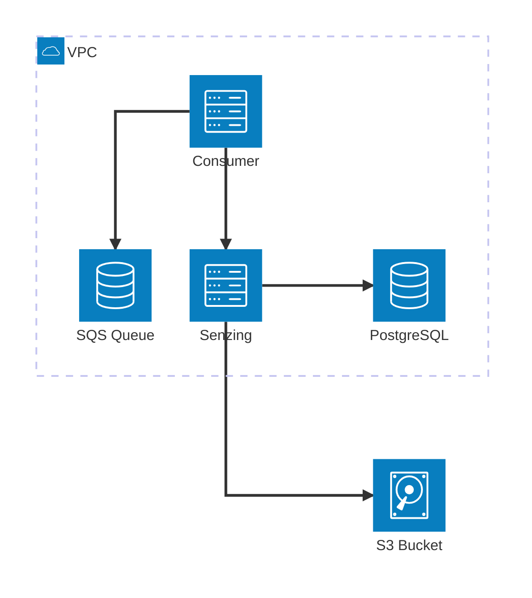

# SQS Entity Resolution using Senzing

This is an implementation of entity resolution using [Senzing] with [AWS
SQS][sqs]. Data is sent to an SQS queue, which is processed by a "consumer"
service that forwards the data to Senzing for entity resolution. The results can
then be exported to an S3 bucket.

[senzing]: https://senzing.com
[sqs]: https://docs.aws.amazon.com/AWSSimpleQueueService/latest/SQSDeveloperGuide/welcome.html
