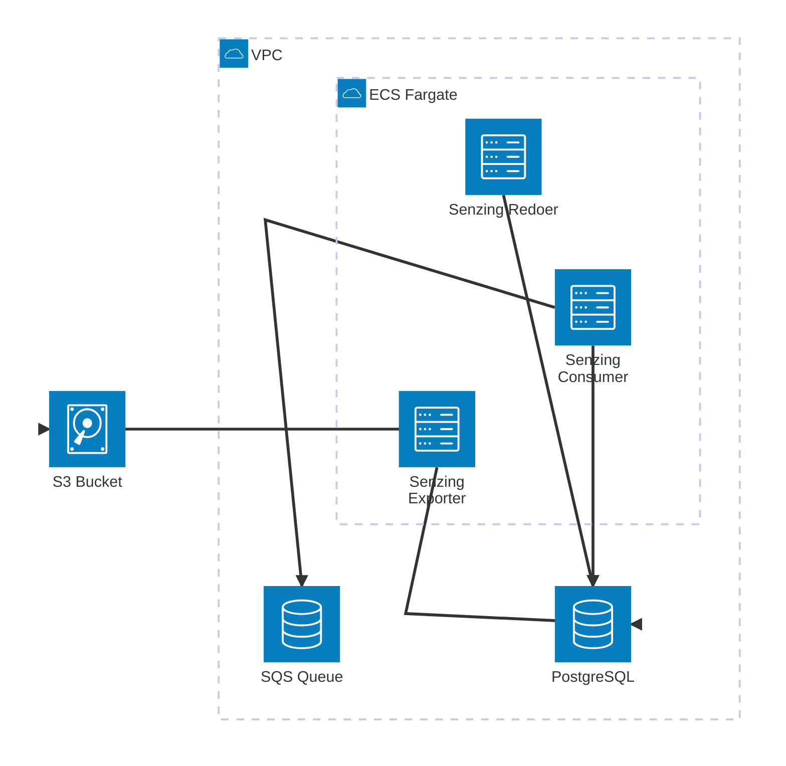

# SQS Entity Resolution Using Senzing

This is an implementation of entity resolution using [Senzing] with [AWS
SQS][sqs]. Data is sent to an SQS queue, which is processed by a "consumer"
service that forwards the data to Senzing for entity resolution. The results can
then be exported to an S3 bucket.



## Local development with Docker

This repository includes a `docker-compose.yml` file that can be used to develop
and run the consumer service on our local machine. This setup includes:

- [SQS][sqs-local] and [S3][s3-local] emulators using [LocalStack]
  - An S3 bucket named `sqs-senzing-local-export`
  - An SQS queue named `sqs-senzing-local-ingest`
  - An SQS queue named `sqs-senzing-local-redo`
- A local PostgreSQL database
- A database initialization container to set up the Senzing schema
- The Senzing consumer service
- A `tools` container with the [Senzing v4 SDK][senzing-sdk] and
  [`awslocal`][awslocal] wrapper for interacting with LocalStack services

### Configuring an AWS profile for LocalStack

To use the tools container or the middleware (consumer, etc.) with LocalStack,
an AWS profile specific to LocalStack will be needed.

Your `~/.aws/config` file should have something like:

    [profile localstack]
    region = us-east-1
    output = json
    ignore_configure_endpoint_urls = true
    endpoint_url = http://localhost:4566

Your `~/.aws/credentials` file should have:

    [localstack]
    aws_access_key_id=test
    aws_secret_access_key=test

Also, when writing custom Python, the `endpoint_url` argument will normally be
needed when instantiating client objects for use with particular LocalStack
services, e.g.:

    sess = boto3.Session()
    if 'AWS_ENDPOINT_URL' in os.environ:
        return sess.client('s3', endpoint_url=os.environ['AWS_ENDPOINT_URL'])
    else:
        return sess.client('s3')

### Starting the services

1. Build the necessary images:

   ```bash
   docker compose build
   docker compose --profile exporter build
   ```

1. Start the services:

   ```bash
   docker compose up -d
   ```

### Using the services (tools container)

Access the `tools` container to interact with the services:

```bash
docker compose run tools /bin/bash
```

The `tools` container needs to be given the necessary environment
variables to interact with the SQS and S3 services in LocalStack, as well as the
Senzing SDK (this is done for you already inside `docker-compose.yaml`).

You can use the `awslocal` command to interact with the SQS and S3 services. For
example, to send a message to the SQS queue:

```bash
awslocal sqs send-message \
  --queue-url http://sqs.us-east-1.localhost.localstack.cloud:4566/000000000000/sqs-senzing-local-ingest \
  --message-body '{"NAME_FULL":"Robert Smith", "DATE_OF_BIRTH":"7/4/1976", "PHONE_NUMBER":"555-555-2088"}'
```

View queues:

    awslocal sqs list-queues

View queue message count, etc.:

    awslocal sqs get-queue-attributes --queue-url \
    http://sqs.us-east-1.localhost.localstack.cloud:4566/000000000000/sqs-senzing-local-ingest \
    --attribute-names All

You can use the Senzing SDK's `sz_*` commands to interact with the Senzing
database. For example, to add a new entity:

```bash
sz_command -C add_record \
  PEOPLE 1 '{"NAME_FULL":"Robert Smith", "DATE_OF_BIRTH":"7/4/1976", "PHONE_NUMBER":"555-555-2088"}'
```

You can also run commands using the tools container without entering an
interactive shell. For example, to purge the repository, you could run:

```bash
docker compose run tools sz_command -C "purge_repository --FORCEPURGE"
```

#### Loading sample data

From inside the tools container:

1. Download the sample data sets; see:
https://senzing.com/docs/quickstart/quickstart_docker/#download-the-files
2. Register the data source names using `sz_configtool`; see:
https://senzing.com/docs/quickstart/quickstart_docker/#add-the-data-source
3. Then, actually load each of the data files into the Senzing database, i.e.:

        sz_file_loader -f customers.jsonl
        sz_file_loader -f reference.jsonl
        sz_file_loader -f watchlist.jsonl

#### Additional utilities

##### Senzing and the database

Load a single record as a simple test:

    docker compose run tools python dev/add_1_record.py

Purge the database:

    docker compose run tools python dev/db_purge.py

##### S3

Copy a file out of the LocalStack S3 bucket into `~/tmp` on your machine (be
sure this folder already exists -- on macOS, that would be
`/Users/yourusername/tmp`):

> [!NOTE]
> You will need to manually create `/Users/yourusername/tmp` if it
> doesn't already exist.

    # Here, `hemingway.txt` is the file you wish to retrieve from S3.
    docker compose run tools python3 dev/s3_get.py hemingway.txt

Purge the LocalStack S3 bucket:

    docker compose run tools python3 dev/s3_purge.py

## Middleware

There are three middleware applications:

- consumer (continually-running service)
- redoer (continually-running service)
- exporter (ephemeral container)

### Consumer

Spinning up the consumer middleware (intended to be a continually-running
process; in a production scenario, multiple instances could be running
simultaneously as needed):

```bash
docker compose run --env AWS_PROFILE=localstack --env \
Q_URL="http://sqs.us-east-1.localhost.localstack.cloud:4566/000000000000/sqs-senzing-local-ingest" \
--env LOG_LEVEL=DEBUG consumer
```

_Environment variables (see docker-compose.yaml):_

- `AWS_PROFILE`
- `AWS_ENDPOINT_URL` (when using LocalStack)
- `Q_URL` -- required; the URL of the AWS SQS primary ingestion queue.
- `SENZING_ENGINE_CONFIGURATION_JSON` -- required.
- `LOG_LEVEL` is optional; defaults to `INFO`.
- `SZ_CALL_TIMEOUT_SECONDS`
  - Optional; defaults to 420 seconds (7 min.)
  - This does two things: sets the (in)visibility of a message when it's
    initially retrieved from SQS
  - Sets the maximum amount of time the Consumer will wait for a Senzing
    `add_record` to complete before bailing and moving on.
- `RUNTIME_ENV` -- the runtime environment (e.g., "Dev", "Prod", etc.).
  - Optional; defaults to "unknown".
- `OTEL_USE_OTLP_EXPORTER` -- 'true' or 'false' (default is false)
- `OTEL_EXPORTER_OTLP_ENDPOINT`
- `PGUSER`
- `PGPASSWORD`
- `PGHOST`

_Mounts in docker-compose.yaml:_

    volumes:
      - ~/.aws:/home/senzing/.aws

_Required record keys:_

- The record to be sent into Senzing requires, at the very least, these two
  keys:
  - `DATA_SOURCE`
  - `RECORD_ID`

### Redoer

Similar to the consumer, the redoer is also a continually-running process.

```bash
docker compose run redoer
```

_Environment variables:_

- `AWS_PROFILE`
- `AWS_ENDPOINT_URL` (when using LocalStack)
- `SENZING_ENGINE_CONFIGURATION_JSON` -- required.
- `LOG_LEVEL` is optional; defaults to `INFO`.
- `SZ_CALL_TIMEOUT_SECONDS`
  - Optional; defaults to 420 seconds (7 min.)
  - Sets the maximum amount of time the Exporter will wait for a Senzing
    `process_redo_record` to complete before bailing and moving on.
- `MAX_REDO_ATTEMPTS` (defaults to 20): It's possible that Senzing's
  `process_redo_record` might raise an `SzRetryableError`; this variable sets
  the max attempts the redoer will make to redo a particular record (if/when
  this particular error keeps getting raised) before moving on to the next
  record.
- `WAIT_SECONDS`
  - Optional; defaults to 10 seconds.
  - When either (a) Senzing's internal redo queue is empty or (b) a
    `SzRetryableError` is encountered, this sets how long to wait before
    attemping the next Senzing op.
- `RUNTIME_ENV` -- the runtime environment (e.g., "Dev", "Prod", etc.).
  - Optional; defaults to "unknown".
- `OTEL_USE_OTLP_EXPORTER` -- 'true' or 'false' (default is false)
- `OTEL_EXPORTER_OTLP_ENDPOINT`
- `ENABLE_OTEL_EMITS`
  - Optional, defaults to `1`
  - Values can be either `0` or `1`
- `PGUSER`
- `PGPASSWORD`
- `PGHOST`

### Exporter

Spinning up the exporter middleware (this is intended to be an ephemeral
container):

```bash
docker compose run exporter
```

- `AWS_PROFILE`
- `AWS_ENDPOINT_URL` (when using LocalStack)
- `SENZING_ENGINE_CONFIGURATION_JSON` -- required.
- `S3_BUCKET_NAME` -- required.
- `FOLDER_NAME` -- optional (defaults to `exporter-outputs`); folder inside S3
  where the file will be placed.
- `LOG_LEVEL` -- optional; defaults to `INFO`.
- `RUNTIME_ENV` -- the runtime environment (e.g., "Dev", "Prod", etc.).
  - Optional; defaults to "unknown".
- `OTEL_USE_OTLP_EXPORTER` -- 'true' or 'false' (default is false)
- `OTEL_EXPORTER_OTLP_ENDPOINT`
- `EXPORT_MODE`
  - Default is `delta`
  - Possible values: `delta` or `full`
- `PGUSER`
- `PGPASSWORD`
- `PGHOST`

_Mounts in docker-compose.yaml:_

    volumes:
      - ~/.aws:/home/senzing/.aws
      - ~/tmp:/tmp # Should you wish to write files to host.

_Viewing S3 contents:_ You can view information about files in the LocalStack S3
bucket by visiting this URL:

    http://localhost:4566/sqs-senzing-local-export

## Running Tests

> [!CAUTION]
> Running these tests will delete all named and unnamed Docker volumes. The
> primary reason is to ensure a fresh database. To change this behavior, take a
> look at `docker_setup()` and modify as desired.

Tests are located in the `test/` folder. The overall flow is tested using
LocalStack components.

One-time setup -- create a virtualenv and install dependencies:

    mkdir venv
    # Use the Python runtime of your choice
    ~/pythons/python-3.12.6/bin/python3.12 -m venv venv
    source venv/bin/activate
    pip install -r requirements.txt

Before each run, activate the virtualenv:

    source venv/bin/activate

Run tests:

    python3 -m unittest discover

The expected report at the end should be that 1 test ran OK.

Deactivate the virtualenv when finished:

    deactivate


[awslocal]: https://docs.localstack.cloud/aws/integrations/aws-native-tools/aws-cli/#localstack-aws-cli-awslocal
[localstack]: https://www.localstack.cloud/
[senzing]: https://senzing.com
[senzing-sdk]: https://senzing.com/docs/python/4/
[s3-local]: https://docs.localstack.cloud/aws/services/s3/
[sqs]: https://docs.aws.amazon.com/AWSSimpleQueueService/latest/SQSDeveloperGuide/welcome.html
[sqs-local]: https://docs.localstack.cloud/aws/services/sqs/
