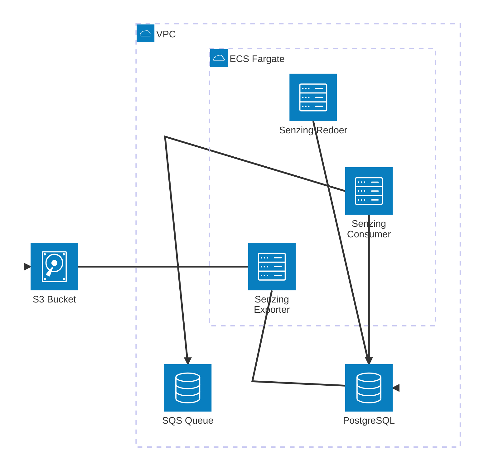

# SQS Entity Resolution Using Senzing

This is an implementation of entity resolution using [Senzing] with [AWS
SQS][sqs]. Data is sent to an SQS queue, which is processed by a "consumer"
service that forwards the data to Senzing for entity resolution. The results can
then be exported to an S3 bucket.

```mermaid
architecture-beta
  group vpc(cloud)[VPC]
  group ecs(cloud)[ECS Fargate] in vpc

  service queue(database)[SQS Queue] in vpc
  service consumer(server)[Senzing Consumer] in ecs
  service redoer(server)[Senzing Redoer] in ecs
  service exporter(server)[Senzing Exporter] in ecs
  service db(database)[PostgreSQL] in vpc
  service s3(disk)[S3 Bucket]

  consumer:L --> T:queue
  redoer:B --> T:db
  exporter:B --> R:db
  exporter:R --> L:s3
  consumer:B --> T:db
```

## Usage

Follow the links below for information and how to use the system and its various
components:

- [Local Development][development]
- [Configuration]
- [Architecture Overview][architecture]
- [Middleware]
- [Operation and Maintenance][operations]
- [Security]
- [Future Enhancements][future]

[architecture]: docs/architecture/index.md
[configuration]: docs/configuration.md
[development]: docs/development.md
[future]: docs/future.md
[middleware]: docs/middleware/index.md
[operations]: docs/operations/index.md
[security]: docs/security.md
[senzing]: https://senzing.com
[sqs]: https://docs.aws.amazon.com/AWSSimpleQueueService/latest/SQSDeveloperGuide/welcome.html
