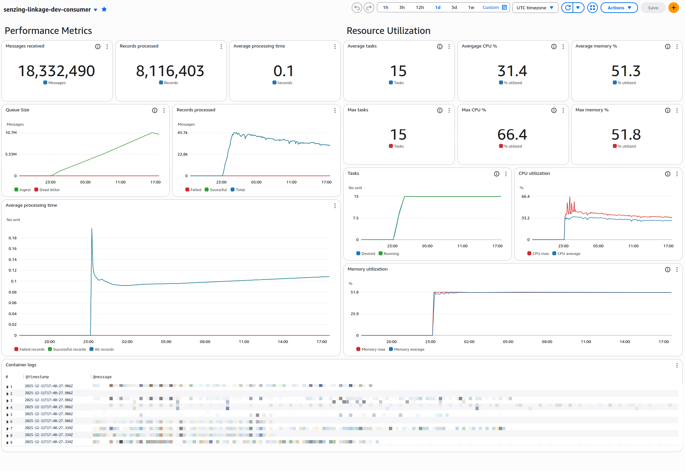
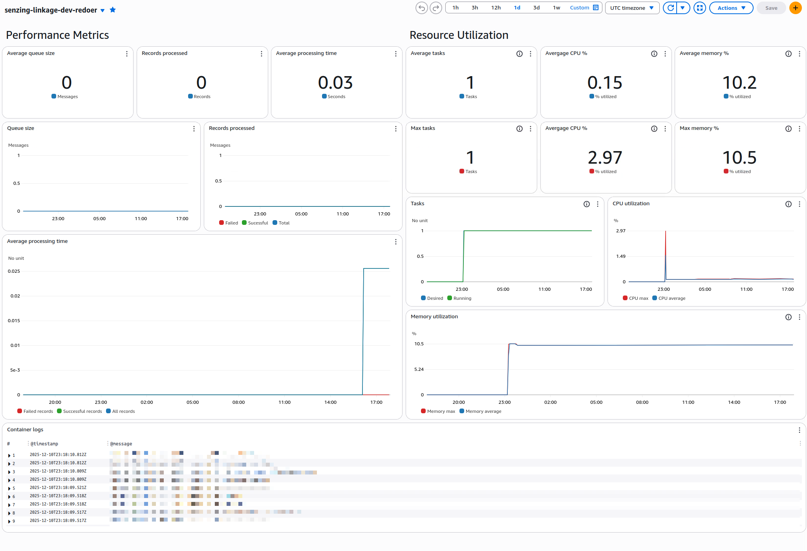
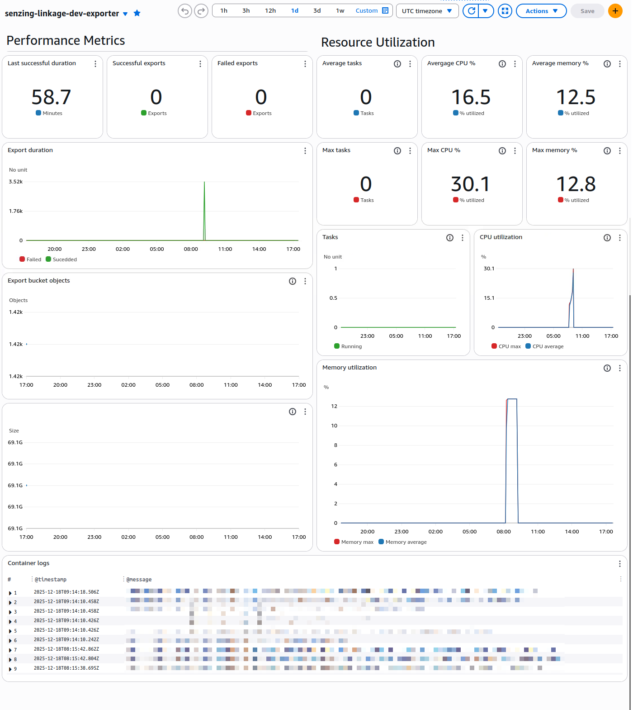

# Monitoring

The service emits several metrics to help monitor its health and performance,
and includes logging to help diagnose issues. Additionally, it includes three
CloudWatch dashboards to help visualize this information.

## Instrumentation

The following metrics are emitted by the service, and collected using the
[AWS Distro for OpenTelemetry][aws-otel]:

| Metric                       | Type      | Tags                               | Description                                                      |
|------------------------------|-----------|------------------------------------|------------------------------------------------------------------|
| `consumer.messages.count`    | counter   | `environment`, `service`, `status` | Counter incremented with each message processed by the consumer. |
| `consumer.messages.duration` | histogram | `environment`, `service`, `status` | Message processing duration for the consumer.                    |
| `exporter.export.count`      | counter   | `environment`, `service`, `status` | Counter incremented with each export request.                    |
| `exporter.export.duration`   | histogram | `environment`, `service`, `status` | Export duration.                                                 |
| `redoer.messages.count`      | counter   | `environment`, `service`, `status` | Counter incremented with each message processed by the redoer.   |
| `redoer.messages.duration`   | histogram | `environment`, `service`, `status` | Message processing duration for the redoer.                      |
| `redoer.queue.count`         | guage     | `environment`, `service`           | Current number of messages in the redoer queue.                  |

In addition to the above metrics, the service also emits standard AWS CloudWatch
metrics for the underlying infrastructure, including CPU and memory usage for
the ECS tasks, and network and disk I/O for the RDS database.

## Dashboards

Each major component of the service has a dedicated CloudWatch dashboard to help
visualize its health and performance. These dashboards can be accessed via the
AWS Management Console.

Each dashboard is prefixed with the project and environment name, followed by
the component name. For example, the dashboard for the consumer in the "dev"
environment would be named `senzing-linkage-dev-consumer`.

### Consumer

The consumer is responsible for processing incoming messages from the SQS
ingestion queue. It scales horizontally based on the size of the queue to ensure
timely processing of messages.

### Redoer

The redoer handles the internal REDO messages generated by Senzing during
ingestion. These messages are used to ensure data consistency and integrity
within the Senzing system. The volume of REDO messages is dependent on the
nature of the data being ingested, and how many matches to existing entities and
records are found. It's not uncommon for the redoer to have very little activity
during periods data ingestion.

### Exporter

The exporter produces either a "full" or "delta" export of the resulting Senzing
data after ingestion has completed. This data is then sent to the S3 exports
bucket.

[aws-otel]: https://aws-otel.github.io/
